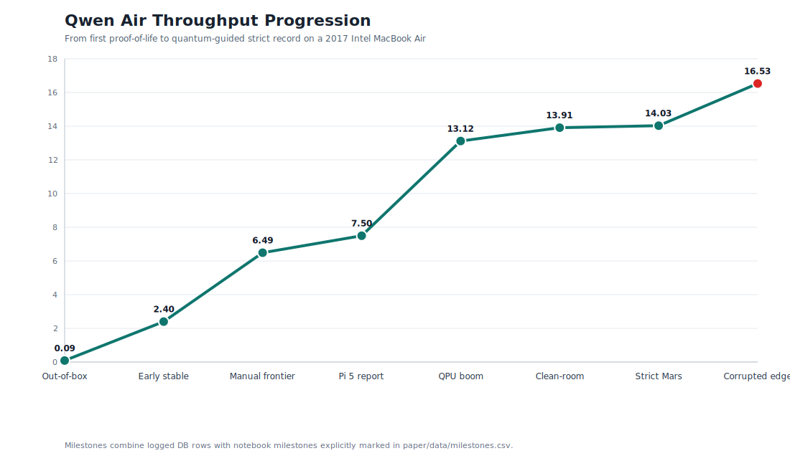

# Qwen Air QPU/MCP Lab

Quantum-enhanced autoresearch for high-performance, CPU-only Mixture-of-Experts
LLM inference on legacy hardware.

This repository contains the benchmark harness, MCP-style tool boundary,
experiment logs, paper draft, and IBM Quantum candidate-sampling workflow from
the 2017 Intel MacBook Air Qwen3 MoE project.

The short version:

- Model: `Qwen3-30B-A3B-Instruct-2507-GGUF`, `Q3_K_S 2.66bpw`
- Hardware: 2017 Intel MacBook Air, 8GB RAM, CPU-only
- Context: 16,384 tokens
- Starting point: about `0.09` generation tokens/sec
- Classical systems optimization frontier: `6.49` generation tokens/sec
- First IBM Quantum-informed breakthrough: `13.12` generation tokens/sec
- Strict quality-gated record: `14.03` generation tokens/sec
- Clean-room Codex-off check: `13.91` generation tokens/sec
- Speed-only rejected lane: `16.53` generation tokens/sec, not claimed because
  output coherence failed



## What Is Novel Here

This is not a claim that an IBM QPU ran Qwen. It did not.

The core contribution is the synchronized loop:

```text
Human Experimenter sets the goal and constraints
    -> Codex proposes, edits, runs, logs, and interprets experiments
    -> the MacBook runs real llama.cpp inference and judges candidates
    -> the local database scores the run frontier
    -> compact candidate choices are compressed into QUBO form
    -> IBM Quantum samples candidate bitstrings
    -> Codex decodes those bitstrings into concrete llama.cpp configs
    -> the MacBook tests them
    -> the loop repeats
```

The QPU improves the research loop's candidate selection. The MacBook remains
the judge. The model remains local. The result is a small hybrid quantum
optimization lab for routed MoE inference.

See the paper draft:

- [Quantum-Enhanced Hyperparameter Tuning for High-Performance On-Device CPU-Only Inference of Mixture-of-Experts LLMs on Legacy Hardware](paper/quantum_enhanced_legacy_moe_inference.md)

## Repository Map

- `paper/` - paper draft, selected run snapshots, and generated SVG figures
- `qpu_mcp_lab/` - benchmark harness, objective scorer, optimizer, QUBO builder,
  IBM Quantum adapter, and MCP-style server
- `scripts/` - experiment drivers and reproducibility scripts
- `docs/REPRODUCIBILITY.md` - validation protocol
- `docs/RESULTS.md` - result narrative and milestone summary
- `SECURITY.md` - secret handling and QPU guardrails
- `config.example.json` - local config template

## Requirements

This repo does not include model weights or a compiled `llama-cli`.

You need:

- Python 3.11 or newer
- a local `llama-cli` or compatible fork build
- the ByteShape GGUF model file:
  `Qwen3-30B-A3B-Instruct-2507-Q3_K_S-2.66bpw.gguf`
- optional IBM Quantum credentials for real QPU jobs

Reference local paths from the original lab:

```bash
~/src/ik_llama.cpp/build-air-iqk-lean/bin/llama-cli
~/qwen-air-tests/models/byteshape-qwen3-30b-a3b-2507/Qwen3-30B-A3B-Instruct-2507-Q3_K_S-2.66bpw.gguf
```

## Quick Start

```bash
git clone https://github.com/Shack870/qwen-air-qpu-mcp-lab.git
cd qwen-air-qpu-mcp-lab

python3 -m venv .venv
. .venv/bin/activate
pip install -r requirements.txt

cp config.example.json config.json
```

Edit `config.json`:

```json
{
  "llama_bin": "~/src/ik_llama.cpp/build-air-iqk-lean/bin/llama-cli",
  "model_path": "~/qwen-air-tests/models/byteshape-qwen3-30b-a3b-2507/Qwen3-30B-A3B-Instruct-2507-Q3_K_S-2.66bpw.gguf",
  "llama_repo": "~/src/ik_llama.cpp",
  "safe_memory_gb": 6.5,
  "default_backend": "local-simulator",
  "allow_real_qpu_jobs_by_default": false
}
```

You can also provide paths through environment variables:

```bash
export QPU_MCP_LAB_LLAMA_BIN="$HOME/src/ik_llama.cpp/build-air-iqk-lean/bin/llama-cli"
export QPU_MCP_LAB_MODEL_PATH="$HOME/qwen-air-tests/models/byteshape-qwen3-30b-a3b-2507/Qwen3-30B-A3B-Instruct-2507-Q3_K_S-2.66bpw.gguf"
```

Validate the environment:

```bash
.venv/bin/python scripts/validate_environment.py
```

Initialize the database:

```bash
.venv/bin/python -m qpu_mcp_lab.cli init-db
```

## Reproduce The Strict Record Lane

Run the record-family config:

```bash
.venv/bin/python -m qpu_mcp_lab.cli run --config-json '{
  "label": "strict_record_reproduction",
  "prompt": "<|im_start|>user\nContinue this comma-separated list of Mars facts: red planet, thin atmosphere,<|im_end|>\n<|im_start|>assistant\n",
  "ctx_size": 16384,
  "batch_size": 2456,
  "ubatch_size": 144,
  "threads": 4,
  "threads_batch": 4,
  "cache_type_k": "q6_0",
  "cache_type_v": "q6_0",
  "flash_attn": true,
  "smart_expert_reduction": "3,1",
  "env_veclib_threads": 1,
  "env_omp_wait_policy": "ACTIVE",
  "env_omp_dynamic": "FALSE",
  "env_ser_cheap_ranges": "24:30",
  "env_ser_cheap_min": 2,
  "env_ser_cheap_thresh": 1.0,
  "n_predict": 128,
  "temp": 0.0,
  "ignore_eos": true,
  "no_display_prompt": true,
  "timeout_seconds": 420
}'
```

Reference results from the original machine:

- strict record: `14.03 tok/s`
- clean-room lane: `13.91 tok/s`
- first QPU-informed jump: `13.12 tok/s`
- classical frontier before QPU sampling: `6.49 tok/s`
- original proof-of-life baseline: about `0.09 tok/s`

Exact repeats vary with thermals, page-cache state, context switches, and prompt
shape. Report both throughput and output quality.

## Quality Gate

A speed result is not a quality result unless the output remains coherent.

The strict gate used short factual/code prompts such as:

1. `What is the capital of Serbia?`
2. `What is the capital of Mars?`
3. `Write a compact Python function named is_prime that checks whether n is prime.`

Known pattern:

- broad speed-only expert reductions can produce high tokens/sec and broken text
- the accepted record lane is lower than the fastest raw lane because it preserves
  coherence

## IBM Quantum API Key Setup

Do not put IBM API keys in Git, `config.json`, `.env`, shell history, screenshots,
paper drafts, logs, or chat messages.

Preferred macOS setup:

```bash
./scripts/store_ibm_key.sh
```

That script prompts for the key without echoing it and stores it in macOS
Keychain under:

- `ibm_quantum_api_key`
- optional `ibm_quantum_instance_crn`

The harness reads credentials in this order:

- `IBM_QUANTUM_API_KEY`, then Keychain service `ibm_quantum_api_key`
- `IBM_QUANTUM_INSTANCE`, then Keychain service `ibm_quantum_instance_crn`

Temporary environment-variable setup also works:

```bash
export IBM_QUANTUM_API_KEY="paste-token-here"
export IBM_QUANTUM_INSTANCE="optional-instance-or-crn"
```

For safety, Keychain storage is preferred.

Check credential status without printing secrets:

```bash
.venv/bin/python -m qpu_mcp_lab.cli quantum-credentials
```

List available IBM backends:

```bash
.venv/bin/python -m qpu_mcp_lab.cli quantum-backends
```

Real QPU submission is guarded. The harness defaults to dry-run or local
simulation unless the command includes `--allow-real-qpu`.

Example guarded workflow:

```bash
.venv/bin/python -m qpu_mcp_lab.cli build-qubo
.venv/bin/python -m qpu_mcp_lab.cli sweep-qaoa-angles --limit 5
.venv/bin/python -m qpu_mcp_lab.cli submit-micro-frontier \
  --backend ibm_fez \
  --shots 256 \
  --allow-real-qpu
```

After an IBM job completes:

```bash
.venv/bin/python -m qpu_mcp_lab.cli quantum-jobs --limit 5
.venv/bin/python -m qpu_mcp_lab.cli job-result JOB_ID --refresh
.venv/bin/python -m qpu_mcp_lab.cli decode-job-candidates JOB_ID --top-k 12
```

The decoded candidates still need to be tested locally. The QPU suggests; the
MacBook judges.

## Run The MCP Server

The local MCP-style server exposes narrow, auditable tools for Codex or other
clients. It does not expose arbitrary shell access and it does not return secret
values.

```bash
./scripts/run_mcp_server.sh
```

Representative tool categories:

- `bench_run_config`
- `bench_get_best_runs`
- `objective_score_run`
- `optimizer_build_qubo`
- `optimizer_propose_classical_candidates`
- `quantum_credential_status`
- `quantum_list_backends`
- `quantum_submit_micro_frontier_job`
- `quantum_decode_job_candidates`

## Paper Figures

Regenerate the SVG figures:

```bash
python3 paper/make_figures.py
```

Generated figures:

- `paper/figures/throughput_progression.svg`
- `paper/figures/qpu_jump.svg`
- `paper/figures/quality_boundary.svg`
- `paper/figures/prompt_examples.svg`

## Safety And Publication Notes

- Model weights are not included.
- IBM secrets are not included.
- `config.json`, `.env`, logs, SQLite WAL/SHM files, and local model files are
  ignored by Git.
- Real IBM QPU use requires an explicit `--allow-real-qpu` flag.
- Publish benchmark claims with command, output, quality gate, context length,
  page faults, swaps, and system state.

## Inspiration

This project was shaped by:

- Dan Woods' Flash-MoE work on SSD-backed MoE inference
- Andrej Karpathy's autoresearch loop
- ByteShape and Potato OS Raspberry Pi Qwen3-30B-A3B demonstrations
- IBM Quantum and Qiskit Runtime candidate sampling
- Codex/GPT-5 as the research loop collaborator and experiment agent

## Citation

See [CITATION.cff](CITATION.cff).
