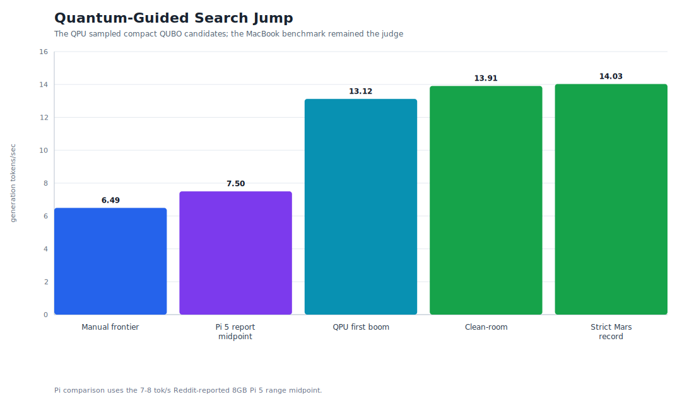
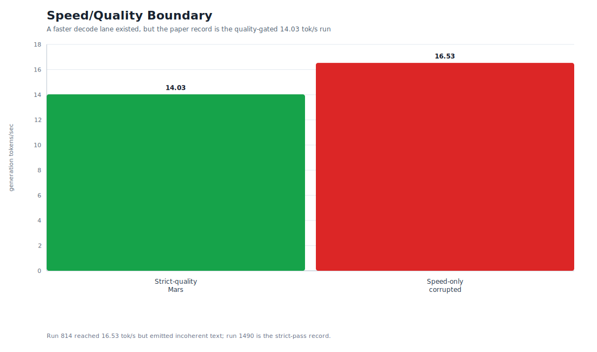
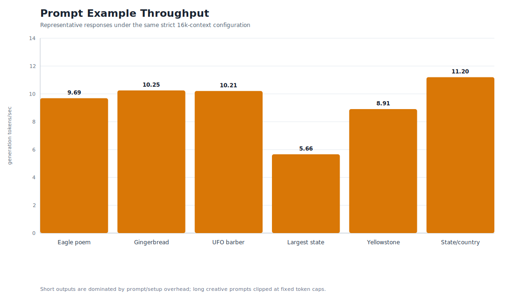

# Quantum-Enhanced Hyperparameter Tuning for High-Performance On-Device CPU-Only Inference of Mixture-of-Experts LLMs on Legacy Hardware

Jody Shackelford, B.C.S., M.S. student, University of Arkansas Grantham  
with Codex/GPT-5 as AI research collaborator and experiment agent

Repository: [Shack870/qwen-air-qpu-mcp-lab](https://github.com/Shack870/qwen-air-qpu-mcp-lab)  
Draft date: 2026-05-26

## Abstract

Using a single quantum-enhanced Karpathy-style autoresearch loop, where Codex/GPT-5 drove the experimental cycle and IBM Quantum reshaped the candidate frontier inside that loop by sampling compact QUBO search spaces, I improved CPU-only inference of `Qwen3-30B-A3B-Instruct-2507-GGUF` on a 2017 Intel MacBook Air by 155.9x, from approximately 0.09 to a quality-gated 14.03 generation tokens/sec at 16,384 context. The experiment used a 30.5B-parameter Mixture-of-Experts (MoE) language model with 3.3B activated parameters on a host machine with only 8GB RAM. I ran the project as a synchronized hybrid quantum optimization lab: Codex proposed, edited, executed, logged, and interpreted experiments; the MacBook judged each candidate through real inference; and IBM Quantum acted inside the same loop by sampling QUBO formulations derived from the run database.

The work unfolded in two phases of one loop. In the initial classical phase, Codex and I used systems optimization alone: llama.cpp rebuilds, mmap discipline, quantized Flash Attention, q6_0 KV cache, expert-scheduling experiments, thermal gating, and process isolation. That moved the machine from proof-of-life performance to a 6.49 tokens/sec frontier, which I consider a meaningful legacy-hardware result by itself. In the quantum-enhanced phase, the same loop gained a Model Context Protocol (MCP) bridge to IBM Quantum hardware. Codex still ran the local experiments, interpreted failures, and edited the harness, but the candidate-selection step now incorporated QPU samples from compact QUBO formulations. That produced a 13.12 tokens/sec jump and ultimately the 14.03 tokens/sec strict record. A faster 16.53 tokens/sec lane was observed, but I rejected it because the output lost coherence. A clean-room run with Codex closed reached 13.91 tokens/sec, suggesting that the record lane was not simply an artifact of Codex consuming memory.

The contribution is not a claim that quantum hardware ran the language model. It did not. The contribution is a reproducible hybrid quantum research workflow for discovering quality-preserving operating regimes in routed MoE inference. I treated the model's active expert path as an empirical systems object: measure it, constrain it, quality-gate it, and let a QPU-informed candidate-selection step inside the Codex autoresearch loop decide which configurations deserved real hardware tests next.

## 1. Introduction

This project began with a deliberately hard question: can a dedicated 2017 Intel MacBook Air with 8GB RAM run a modern 30B-class MoE model in a way that is not merely symbolic, but usable enough to be scientifically interesting?

The machine was not chosen because it was ideal. It was chosen because it was wrong for the job in almost every conventional way. It has a 1.8GHz dual-core Intel Core i5, 8GB of 1600MHz LPDDR3 memory, Intel HD Graphics 6000, and an internal PCIe SSD. Apple lists the 2017 MacBook Air test systems as tested in May 2017. The first public version of *Attention Is All You Need* was submitted to arXiv on June 12, 2017. In other words, the hardware predates the first public Transformer paper.

That historical mismatch is part of the scientific appeal. I was not trying to prove that a 2017 MacBook Air is a good LLM computer. I was trying to find out how far a modern MoE can be pushed on hardware that should not obviously be able to run it interactively.

The result was a 155.9x improvement from the first lab-notebook baseline of approximately 0.09 tokens/sec to a strict 14.03 tokens/sec record. The shape of that story matters:

1. Classical systems work moved the machine from barely alive to 6.49 tokens/sec.
2. Embedding IBM Quantum candidate sampling into the Codex loop changed the search dynamics and produced a 13.12 tokens/sec jump.
3. Continued Codex-driven local refinement inside that same loop produced a quality-gated 14.03 tokens/sec record.
4. A 16.53 tokens/sec speed-only lane revealed the boundary where speed outran coherence.


I wrote this paper from my perspective as the investigator driving the experiment. Codex/GPT-5 acted as a research collaborator inside the loop: reading logs, proposing experiments, editing scripts, building the MCP/QPU harness, decoding IBM Quantum samples into llama.cpp candidates, and helping interpret results. The final benchmark claims remain grounded in local run logs and SQLite records.

## 2. Model and Hardware

The target model was [Qwen3-30B-A3B-Instruct-2507](https://huggingface.co/Qwen/Qwen3-30B-A3B-Instruct-2507), accessed through the [ByteShape GGUF release](https://huggingface.co/byteshape/Qwen3-30B-A3B-Instruct-2507-GGUF). I used the `Q3_K_S` 2.66bpw quant:

```text
Qwen3-30B-A3B-Instruct-2507-Q3_K_S-2.66bpw.gguf
```

The local metadata reported:

- architecture: qwen3moe
- total parameters: 30.532B
- local file size: 9.471 GiB
- BPW: 2.664
- layers: 48
- experts: 128
- active experts: 8
- native context length: 262,144 tokens

The host system:

- 2017 13-inch Intel MacBook Air
- 1.8GHz dual-core Intel Core i5
- 8GB 1600MHz LPDDR3 RAM
- Intel HD Graphics 6000
- internal PCIe SSD, more than 200GB free during the project
- macOS 12.7.6

The record inference mode:

- CPU-only
- no GPU layers
- mmap enabled
- no mlock
- 16,384 context
- q6_0/q6_0 KV cache
- quantized Flash Attention enabled in the local llama.cpp build

The strict 14.03 tokens/sec run reported:

- AVX, AVX2, FMA, F16C, and BLAS enabled
- no AVX512
- no GPU offload
- zero swaps
- 9 page faults
- peak RSS 5.23GB

The most important architectural fact is that this is not a dense model. A dense model forces every token through the same full parameter path. This MoE model has a large total parameter reservoir, but a much smaller routed active path per token. That made the project a routed-systems optimization problem, not just a "make llama.cpp faster" exercise.

## 3. Related Work and Inspiration

Dan Woods' [Flash-MoE](https://github.com/danveloper/flash-moe) was the conceptual spark. Flash-MoE shows that large MoE inference can be made practical by exploiting sparsity, streaming active expert weights, using SSD and the OS page cache intelligently, and avoiding dense-model assumptions. I could not reproduce Dan's implementation path on this MacBook Air. I did not have Apple Silicon, a large unified-memory pool, or a useful Metal route. But the mental model transferred directly: treat the MoE as a routed system and search for the active path that matters.

Karpathy's [autoresearch](https://github.com/karpathy/autoresearch) influenced the experimental process. I treated the lab as a loop:

```text
propose -> edit -> run -> log -> score -> keep or discard -> propose again
```

That loop became much more powerful when paired with Codex. Codex could keep the experiment moving, read logs faster than I could, build scripts, summarize failures, and translate high-level hunches into concrete benchmark runs. The important twist in this project is that I did not bolt IBM Quantum onto the side as a separate experiment. I placed IBM Quantum inside the loop at the candidate-selection step, turning the loop itself into a quantum-enhanced Karpathy-style autoresearch system:

```text
Codex proposes and edits
    -> MacBook benchmarks
    -> SQLite logs
    -> objective scoring
    -> QUBO compression
    -> IBM Quantum samples candidate bitstrings
    -> Codex decodes those samples into candidate configs
    -> Codex tests the next configurations locally
```

That is the core news of the project: a practical, local, quantum-enhanced autoresearch loop where Codex and IBM Quantum operated in sync to optimize modern MoE inference on legacy hardware.

The Raspberry Pi community gave me an external comparison target. A Reddit post by `u/jslominski` reported [Qwen3-30B-A3B-Instruct-2507-GGUF Q3_K_S 2.66bpw at 7-8 tokens/sec on a Raspberry Pi 5 8GB with SSD](https://www.reddit.com/r/LocalLLaMA/comments/1rywym9/followup_qwen3_30b_a3b_at_78_ts_on_a_raspberry_pi/), crediting `u/PaMRxR` for the ByteShape quant lead and linking [Potato OS](https://github.com/potato-os/core). ByteShape's own blog reports 8.48 TPS for a 2.66bpw Pi 5 16GB configuration. My strict 14.03 tokens/sec result on the 2017 Intel MacBook Air nearly doubles the Reddit-reported 7-8 tokens/sec 8GB Pi range while using a different CPU-only path.

IBM Quantum and Qiskit provided the quantum-classical candidate-selection primitive inside the loop. The quantum processor did not accelerate inference. Instead, QPU samples reshaped the candidate frontier that Codex tested next. MCP provided the tool boundary so Codex could interact with the benchmark runner, optimizer, QUBO builder, and IBM adapter in a structured way.

## 4. Method

The method is best understood as one quantum-enhanced Karpathy loop. I used the same basic research rhythm that makes autoresearch powerful, but I inserted QPU-backed candidate sampling between "score" and "test the next thing." This turned a human/AI trial-and-error loop into a synchronized hybrid quantum optimization loop:

```text
human goal and constraints
    -> Codex proposes an experiment
    -> Codex edits scripts or configs
    -> MacBook runs llama.cpp benchmark
    -> logs are parsed into SQLite
    -> objective function scores the run
    -> promising local frontier is compressed into QUBO
    -> IBM Quantum samples candidate bitstrings
    -> Codex decodes samples into new configs
    -> the MacBook judges them with real inference
    -> Codex updates the frontier
```

This is different from merely running a grid search. The loop combines human scientific taste, AI-assisted coding, local empirical measurement, and QPU candidate sampling. The quantum part did not replace classical optimization, and Codex did not operate separately from the QPU results. The QPU informed the candidate frontier; Codex interpreted and executed that frontier; the MacBook judged it; the resulting data fed the next loop.

### 4.1 Measurement Discipline

Every serious run was logged to SQLite. I recorded:

- label and source
- full config JSON
- prompt
- llama.cpp binary and commit
- model path
- context, batch, ubatch, and threads
- KV cache types
- Flash Attention state
- smart expert reduction settings
- stdout tail and timings
- peak RSS
- page faults and swaps when available

The benchmark objective favored generation throughput, but I did not accept incoherent output as a win. This became essential later, because the fastest observed lane reached 16.53 tokens/sec but emitted broken text.

### 4.2 Phase One: Classical Systems Optimization

Before I introduced IBM Quantum, I pushed the machine using classical systems work only. This included:

- building llama.cpp from source instead of relying on Homebrew binaries
- disabling GPU and Metal paths on the Intel Air
- keeping mmap enabled
- avoiding mlock
- testing context, batch, and ubatch ladders
- sweeping q4/q6/q8 KV cache options
- enabling quantized Flash Attention with `-DGGML_IQK_FA_ALL_QUANTS=ON`
- testing thread and batch-thread combinations
- using process-priority and clean-room checks
- cooling the machine between important runs
- controlling prompts and output length

This phase moved the machine from approximately 0.09 tokens/sec to 6.49 tokens/sec.

I want to emphasize this point because it is easy to let the quantum result steal the whole story. The classical phase alone is significant. It showed that a 2017 8GB Intel laptop could move from barely generating to usable MoE inference through disciplined CPU-only engineering.

### 4.3 Phase Two: Quantum-Informed Candidate Selection

After the classical frontier stabilized around 6.49 tokens/sec, I made the existing Codex loop quantum-enhanced at the candidate-selection boundary. I did this because manual sweeps and local heuristics had started to circle the same region. The question became: how should the loop choose the next promising configurations?

The MCP-style harness exposed narrow tools:

- benchmark runner
- experiment database
- objective scorer
- classical optimizer
- QUBO builder
- IBM Quantum adapter
- QPU job/result decoder

The QPU did not inspect the MacBook's memory state, page cache, or KV cache. Instead, the loop compressed local benchmark evidence into small binary optimization problems:

```text
local benchmark runs
    -> stability-aware objective score
    -> binary candidate encoding
    -> QUBO / Ising-style formulation
    -> IBM QPU sampling
    -> bitstrings
    -> Codex-decoded llama.cpp configs
    -> real MacBook benchmark
```

The MacBook remained the judge. The QPU reshaped the candidate frontier. Codex turned sampled bitstrings into concrete configs and then ran the local tests that proved or disproved them.

IBM jobs in the project log used backends including `ibm_fez`, `ibm_kingston`, and `ibm_marrakesh`, with QUBOs between 8 and 14 variables and 128 to 320 shots. One important QUBO encoded batch-size, ubatch-size, and KV-cache choices around the hot lane:

- `batch_1792`, `batch_2048`, `batch_2304`, `batch_2560`, `batch_2816`, `batch_3072`, `batch_3328`
- `ubatch_80`, `ubatch_96`, `ubatch_112`, `ubatch_128`
- `kv_q6_q6`, `kv_k6_v4`, `kv_q4_q4`

The inflection point was run 635:

- label: `qpu_top1_b2304_ub96_repeat2`
- source: `qpu-record-drive`
- generation: 13.12 tokens/sec
- prompt eval: 15.59 tokens/sec
- context: 16,384
- batch/ubatch: 2304/96
- KV: q6_0/q6_0
- expert scheduling: `3,1`
- swaps: 0

This was the "boom" result. It moved the lab from a 6.49 tokens/sec classical frontier to 13.12 tokens/sec. In my view, this is where the autoresearch loop visibly became a hybrid quantum optimization loop rather than a manual or purely classical search.



### 4.4 Routerclamp and Quality-Gated Expert Scheduling

The most productive inference idea was what I called Routerclamp: a controlled search over expert-scheduling regimes. I was not trying to make a smaller model pretend to be Qwen. I was trying to discover which routed execution regimes preserve useful output quality on this hardware.

The strict record lane used:

```text
ctx_size                 16384
threads                  4
threads_batch            4
batch_size               2456
ubatch_size              144
cache_type_k             q6_0
cache_type_v             q6_0
flash_attn               true
smart_expert_reduction   3,1
env_ser_cheap_ranges     24:30
env_ser_cheap_min        2
env_ser_cheap_thresh     1.0
VECLIB_MAXIMUM_THREADS   1
OMP_WAIT_POLICY          ACTIVE
OMP_DYNAMIC              FALSE
n_predict                128
temp                     0.0
ignore_eos               true
```

The interpretation:

- keep the model mmap-backed
- keep KV at q6_0 for stability
- use a large enough batch/ubatch to unlock throughput
- reduce expert cost only in carefully chosen layer bands
- use deterministic prompts for evaluation
- reject settings that cross the speed/quality boundary

## 5. Results

### 5.1 Main Record

The strict quality-gated record was:

- run id: 1490
- timestamp: 2026-05-26T03:35:59+00:00
- label: `near_b2456_ub144`
- source: `thermal-gated-nearmiss-pass`
- prompt: Mars fact continuation
- generation throughput: 14.03 tokens/sec
- prompt eval throughput: 17.50 tokens/sec
- total time: 10.47 seconds
- context: 16,384
- peak RSS: 5.23GB
- page faults: 9
- swaps: 0
- quality flag: `strict_passed`

Prompt:

```text
<|im_start|>user
Continue this comma-separated list of Mars facts: red planet, thin atmosphere,<|im_end|>
<|im_start|>assistant
```

Recorded response:

```text
Here's a comma-separated list of Mars facts, continuing from your initial list:

Red planet, thin atmosphere, largest known solar system body, Mars moon, frozen sea, polar ice caps, dusty atmosphere, methane plumes, surface features, active geology, radiation belts, frozen water ice, methane plumes, storm season, frozen CO2, polar vortex, frozen CO2, frozen water, frozen CO2, frozen water, frozen CO2, frozen water, frozen CO2, frozen water, frozen CO2, frozen water, frozen CO2, frozen water, frozen CO2, frozen water, frozen CO2, frozen water
```

This response is not perfect. It repeats several facts and includes an inaccurate phrase, "largest known solar system body." I still include it because it is the exact 14.03 tokens/sec record output and because it is coherent enough to distinguish the strict lane from the corrupted speed-only lane. The shorter factual prompts below are stronger evidence of factual question-answer behavior.

### 5.2 Speed/Quality Boundary

The top raw speed run reached 16.53 tokens/sec:

- run id: 814
- label: `routerclamp_speed_raw_b2304_ub104_ser1_5`
- source: `routerclamp-supernova`
- generation throughput: 16.53 tokens/sec
- prompt eval: 25.11 tokens/sec
- swaps: 0
- page faults: 3

But the output was incoherent:

```text
percouplesPO122 hrs from my No inaceg: v100 Book Purch reduction3. First ake Italian ...
```

I do not claim 16.53 tokens/sec as the usable result. I report it as a boundary condition: it showed that the machine could decode faster, but not while preserving coherence. The real record is 14.03 tokens/sec with a strict-pass response.



### 5.3 Prompt Response Examples

I also ran direct prompt-response tests under the same 16k-context record-family configuration. Short factual prompts terminated cleanly. Longer creative prompts sometimes clipped at fixed token caps and showed more degradation, which I report as a limitation.



#### Factual Prompt A: Largest U.S. State

Prompt:

```text
What US state is the largest? Answer in one short sentence.
```

Run id: 1669  
Generation throughput: 5.66 tokens/sec  
Response:

```text
The largest U.S. state by land area is Alaska. [end of text]
```

#### Factual Prompt B: Yellowstone

Prompt:

```text
In what state is Yellowstone National Park? Answer accurately in one short paragraph.
```

Run id: 1670  
Generation throughput: 8.91 tokens/sec  
Response:

```text
Yellowstone National Park is primarily located in the northwestern region of Wyoming, with a small portion extending into Montana and Idaho. [end of text]
```

#### Factual Prompt C: State versus Country

Prompt:

```text
What does it mean to be a State instead of a Country? Answer clearly and concisely.
```

Run id: 1671  
Generation throughput: 11.20 tokens/sec  
Response:

```text
In international relations, a "state" refers to a single, independent political entity with defined borders, a sovereign government, and recognized authority-typically a nation-state, such as Japan or France. The term "country" is often used interchangeably with "state" in everyday language, but in technical terms, "state" refers to a sovereign government with the power to govern itself, while "country" is a broader, more general term for a geographical and political reality. So, being a "state" means being a legally recognized sovereign nation, while "being a country" means having a government with real authority and global recognition-like a state in the international system. [end of text]
```

#### Creative Prompt A: Eagle Poem

Prompt:

```text
Write a poem about an Eagle who must persever and move forward after the heartbreak of losing an egg to a snake.
```

Run id: 1666  
Generation throughput: 9.69 tokens/sec  
Response excerpt:

```text
Upon a high crag, sharp as bone and bone,
Where frost-wired winds and silence slyly creep,
Rises the raptor- aloof, alone-
And the shadow of silence, deep and deep.

Its talons still grip the edge of the sky,
Claws tightened against fire, raw and thin.
Below, where ashen ailerons sigh-
The mark of the snake, and the mark of the sky.
```

The poem clipped at 128 predicted tokens.

#### Creative Prompt B: Gingerbread House

Prompt:

```text
Describe how to build a Christmas gingerbread house.
```

Run id: 1667  
Generation throughput: 10.25 tokens/sec  
Response excerpt:

```text
Building a Christmas gingerbread house, also known as a "gingerbread fort" or "gingerbread house," is a festive and fun activity-especially during the holiday season! ...
```

This response clipped before completing the recipe and contained odd wording. It demonstrates that the record configuration is useful for short factual/code snippets and small demos, but long-form generation still needs separate quality tuning.

#### Creative Prompt C: UFO Barber Comedy

Prompt:

```text
Output a short script of a comedy scene between a man and his barber after seeing a UFO.
```

Run id: 1668  
Generation throughput: 10.21 tokens/sec  
Response excerpt:

```text
Title: "The Clipper & The Cut"
Setting: A small, cozy, slightly shabby barber shop called "Fuzzy's Trim & Tidy"
Time: Late afternoon (slightly post-sunset)
Characters:
- Darryl - 50s, a laid-back customer who just moved into the adjacent apartment.
- Earl "Fuzz" Fuzzler - 60s, the barber with electric-blue short hair, a goatee...
```

This clipped and did not obey the later "dialogue only" constraint, so I report it as a limitation, not as a quality proof.

## 6. Novel Contributions

### 6.1 Broad Contribution

The central contribution is a first-person, reproducible, quantum-enhanced Karpathy-style research loop for MoE inference on legacy hardware. The complete lab was not a Codex loop plus a separate QPU experiment; it was one synchronized loop whose candidate frontier was repeatedly shaped by IBM Quantum samples. It included:

- an LLM collaborator
- a legacy MacBook benchmark target
- a SQLite experiment database
- a stability-aware objective function
- a QUBO builder
- IBM Quantum hardware access
- local scripts that converted sampled bitstrings into real llama.cpp configurations

I draw the boundary carefully: the QPU did not run Qwen. The QPU helped reshape the search frontier that Codex tested on the MacBook. The novelty is the integration: Codex-driven autoresearch, local legacy-hardware inference benchmarks, and IBM Quantum candidate sampling operating as one research system.

I have not found a prior public artifact combining all of the following:

1. A 30B-total MoE model running locally on an 8GB legacy Intel laptop.
2. CPU-only inference at 16k context.
3. Quality-gated throughput above 14 tokens/sec.
4. A Codex/LLM-driven Karpathy-style autoresearch loop whose candidate frontier was reshaped by IBM Quantum samples.
5. A local MCP tool boundary for benchmark execution and QPU access.
6. IBM Quantum QPU jobs used to sample compact hyperparameter/QUBO search spaces for LLM inference tuning.
7. A public SQLite-backed run log connecting the quantum-informed loop, local benchmark outcomes, and rejected speed-only failures.

### 6.2 Device-Specific Contribution

The device-specific claim is:

> A 2017 Intel MacBook Air with 8GB RAM, no useful LLM GPU offload, and a model file larger than physical memory achieved a quality-gated 14.03 generation tokens/sec on Qwen3-30B-A3B-Instruct-2507-GGUF at 16,384 context.

This matters because the machine is not a modern AI workstation. It is a pre-Transformer-era consumer laptop. The result suggests that older hardware can still become a useful inference research platform when the model architecture, operating system behavior, and search process are treated as one coupled system.

### 6.3 Conceptual Contribution

The key conceptual shift is:

> Discover quality-preserving routed execution regimes for a modern MoE on hardware not normally expected to run it interactively.

I do not frame this as making a small model pretend to be the full model. I frame it as empirical routed-systems research. The MoE router, expert activation pattern, KV cache, batch geometry, CPU cache behavior, memory pressure, and benchmark objective all interact. The job is to find operating regimes where that interaction stays coherent and fast.

The rejected 16.53 tokens/sec run matters because it proves the system can move beyond the quality frontier. The accepted 14.03 tokens/sec run matters because it shows where speed and coherence still overlap.

## 7. Discussion

The project advanced in phases:

1. Proof of life: approximately 0.09 tokens/sec.
2. llama.cpp and mmap discipline: low single-digit tokens/sec.
3. batch, ubatch, KV, Flash Attention, and thermal tuning: 6.49 tokens/sec.
4. IBM Quantum candidate sampling inside the Codex loop: 13.12 tokens/sec.
5. continued local refinement within the same loop: 13.91 clean-room and 14.03 strict-pass.
6. speed-only frontier: 16.53 tokens/sec, rejected as incoherent.

The first three phases are the classical result. They show that the device can be made surprisingly capable without quantum help. The later phases are the same autoresearch loop operating in hybrid quantum mode. The point is not that Codex and the QPU made separate contributions in sequence; the point is that QPU-sampled candidates changed what the Codex-driven loop tested next, and those tests exposed the high-throughput regime that led to the record lane.

The biggest lesson is that SSD capacity alone was not the speed win. The model file could live on disk, and mmap/page cache made survival possible, but decode speed came from finding a stable routed-compute regime that stayed inside a quality envelope.

GPU offload also did not become the answer. The Intel HD Graphics 6000 shares system memory and lacks the modern kernels and bandwidth needed for this workload. Moving parts of the graph to that GPU risked overhead and contention. The useful acceleration came from:

- CPU-friendly quantized kernels
- q6 KV stability
- selective expert scheduling
- batch/ubatch geometry
- thermal/process isolation
- IBM Quantum candidate sampling inside the Codex autoresearch loop

## 8. Limitations

I do not claim that any 8GB old laptop can run every 30B MoE well.

Known limits:

- The 14.03 record is prompt- and workload-sensitive.
- Long creative generations clipped at fixed token caps and sometimes degraded.
- The 16.53 tokens/sec lane was incoherent and is not claimed as usable.
- Short factual prompts can show lower measured tokens/sec because setup and prompt overhead dominate.
- The quantum contribution is indirect. It improves candidate selection inside the research loop, not inference math.
- Current quality gates are small and hand-designed.
- Stronger follow-up work should add systematic benchmark suites and repeated statistical confidence intervals.
- The local llama.cpp branch includes experimental expert scheduling behavior that should be independently validated.

## 9. Reproducibility

Artifacts included in this repository:

- `paper/data/qpu_lab_public.sqlite`: sanitized public benchmark and quantum job database
- `paper/data/selected_runs.csv`: paper run snapshot
- `paper/data/milestones.csv`: milestone chart data
- `paper/data/source_summary_top30.csv`: run-source summary
- `paper/figures/*.svg`: regenerated figures
- `qpu_mcp_lab/`: MCP-style quantum/classical harness
- `scripts/`: benchmark and search drivers
- `docs/REPRODUCIBILITY.md`: setup notes
- `docs/RESULTS.md`: result summary

To regenerate paper figures:

```bash
cd /Users/jodyshackelford/qwen-air-tests/qpu-mcp-lab
python3 paper/make_figures.py
```

## 10. Conclusion

I began with an old MacBook Air and an unreasonable benchmark. The classical phase of the loop pushed the machine from approximately 0.09 to 6.49 tokens/sec. That alone showed that careful CPU-only systems work can make a modern MoE usable on legacy hardware. Then I made the same loop quantum-enhanced: the MCP/QPU bridge changed how Codex selected the next candidates. That synchronized loop moved the lab from 6.49 to a 13.12 tokens/sec breakthrough, and continued local refinement carried the result to a strict 14.03 tokens/sec record.

The practical result is a 155.9x throughput improvement on a 2017 Intel MacBook Air running a 30.5B-total-parameter MoE at 16k context, CPU-only. The scientific result is a small hybrid quantum optimization lab for routed MoE inference: one quantum-enhanced Karpathy loop where an LLM collaborator, a legacy device, a benchmark database, and real QPU sampling worked in sync to push a system past what initially looked possible.

The next question is:

> How far can quantum-assisted, quality-gated systems research push routed MoE inference on hardware previously considered out of bounds?

## References

1. Vaswani et al., [Attention Is All You Need](https://arxiv.org/abs/1706.03762), arXiv:1706.03762.
2. Apple, [MacBook Air (13-inch, 2017) Technical Specifications](https://support.apple.com/en-us/111924).
3. Qwen, [Qwen3-30B-A3B-Instruct-2507 model card](https://huggingface.co/Qwen/Qwen3-30B-A3B-Instruct-2507).
4. ByteShape, [Qwen3-30B-A3B-Instruct-2507 GGUF files](https://huggingface.co/byteshape/Qwen3-30B-A3B-Instruct-2507-GGUF).
5. ByteShape, [A 30B Qwen Model Walks Into a Raspberry Pi... and Runs in Real Time](https://byteshape.com/blogs/Qwen3-30B-A3B-Instruct-2507/).
6. `u/jslominski`, [Qwen3 30B A3B at 7-8 t/s on a Raspberry Pi 5 8GB](https://www.reddit.com/r/LocalLLaMA/comments/1rywym9/followup_qwen3_30b_a3b_at_78_ts_on_a_raspberry_pi/).
7. Potato OS, [potato-os/core](https://github.com/potato-os/core).
8. Dan Woods, [flash-moe](https://github.com/danveloper/flash-moe).
9. Andrej Karpathy, [autoresearch](https://github.com/karpathy/autoresearch).
10. IBM Quantum, [Introduction to Qiskit Runtime primitives](https://qiskit.qotlabs.org/docs/guides/qiskit-runtime-primitives).
11. IBM Quantum Learning, [Utility-scale QAOA](https://qiskit.qotlabs.org/learning/courses/quantum-computing-in-practice/utility-scale-qaoa).
12. Model Context Protocol, [Tools specification](https://modelcontextprotocol.io/specification/2025-06-18/server/tools).
